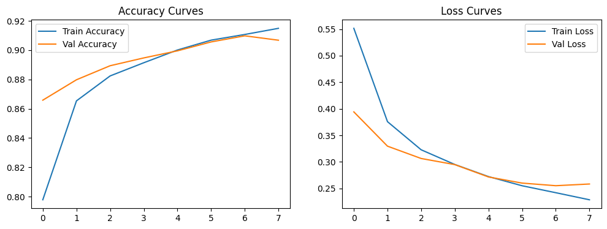
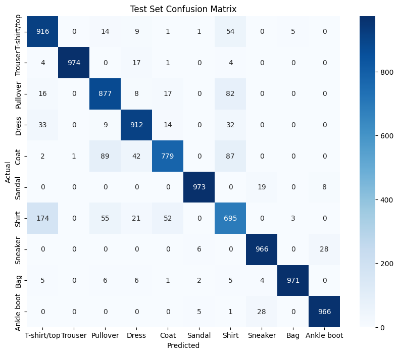

# Image Classification — Basic CNN

## Overview
This project builds and evaluates a Convolutional Neural Network (CNN) using TensorFlow/Keras to classify apparel images from the Fashion-MNIST dataset.

---

## Model Architecture
* **Conv2D Layer 1:** 32 filters (3x3), ReLU activation
* **MaxPooling2D Layer 1:** (2x2) pool size
* **Conv2D Layer 2:** 64 filters (3x3), ReLU activation
* **MaxPooling2D Layer 2:** (2x2) pool size
* **Regularization:** Dropout (0.25) to prevent overfitting
* **Classifier:** Dense layer (64 units) + Softmax Output (10 classes)

---

## Performance Summary
* **Training Accuracy:** ~92%
* **Validation Accuracy:** ~90%
* **Loss Monitoring:** Validation loss curves remained stable alongside training loss, confirming effective regularization via Dropout.

---

## Interview Questions & Answers

### 1. What does a convolutional layer do?
A convolutional layer applies learnable spatial filters (kernels) across an input image to extract key visual features such as edges, textures, and shapes while maintaining spatial relationships.

### 2. How can training curves reveal overfitting?
Overfitting occurs when training loss continues to decrease while validation loss starts rising (or training accuracy keeps climbing while validation accuracy plateaus/drops). This gap indicates the model is memorizing training data rather than generalizing.

### 3. What is the purpose of pooling?
Pooling (e.g., Max Pooling) progressively reduces the spatial dimensions (width x height) of feature maps. This reduces computational workload, minimizes parameter count, and provides translation invariance (making feature detection less sensitive to exact pixel locations).

## Performance & Visual Evaluation

### Training & Validation Curves

### Test-Set Confusion Matrix

